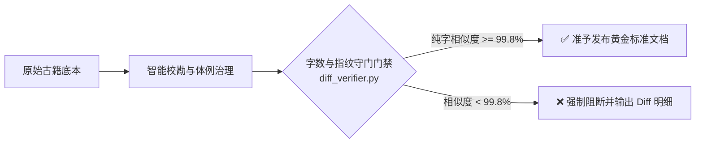
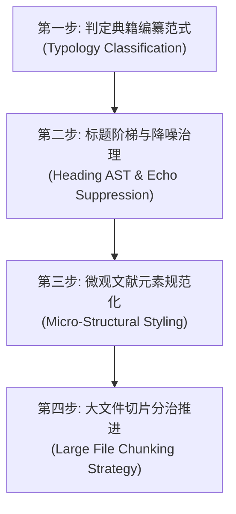

# classics-philology-normalizer

> **古籍文献数字化校勘与结构化规范引擎**：专用于中华传统命理与古典文献 Markdown 的智能化校勘、体例规范化与层级治理。能够智能消除爬虫与 OCR 杂音、重构标准的卷-篇-章-节标题树、结构化经注案微观元素，并保证古籍原文零改动、零删减。

[]()
[]()
[]()

---

## 📖 核心使命与工程定位

中国传统古典文献（尤其是命理、术数与哲理类典籍，如《三命通会》《渊海子平》《滴天髓》《子平真诠》《穷通宝鉴》等）在互联网数字化流传中普遍面临三大痛点：

1. **数字化噪音泛滥**：网络爬虫遗留的页面标记（如“第 1 页”、“下一页”、“源站地址”）、OCR 识别断行失序、无用推广水印混杂；
2. **体例结构腐化**：标题层级错乱、机械回声标题（`## 论五行` 紧跟 `### 论五行`）、注疏正文整段嵌入标题中、卷/篇容器缺失；
3. **微观元素失范**：经文与原注（双行小字）混淆、名家评注边界模糊、实证八字命造干支混在白话叙述中难于检索、韵文歌赋失去对仗。

`classics-philology-normalizer` 将**古典文献学（版本学、目录学、校勘学、体例学）**与**现代软件工程（Markdown AST、知识图谱、分治流处理）**深度结合，以**正文绝对保真原则**为底线，提供确定性、高精度的数字化治理解决方案。

---

## 🛡️ 两大核心执行铁律 (The Core Invariants)



1. **正文绝对保真原则 (Zero Semantic/Textual Mutation)**：
   * **严禁改写或润色**：古籍正文字句（即便是生僻字、异体字、古通假字、断句或原著本身的笔误）必须 100% 原样保留，**严禁使用现代汉语白话重写**，严禁擅自“纠错字”！
   * **允许清除的仅限两类非正文杂音**：
     - a. 爬虫或排版残留的页面标记（如：`第 一 页`、`下一页`、`源站地址：...`）；
     - b. 标题层级复制造成的机械回声行（如紧挨在一起的相同标题）。
2. **字数与指纹守门门禁 (Text Diff Invariance)**：
   * 清洗前后，剥离所有 Markdown 标记（`#`、`>`、`|`、`-`）后的纯文本字符相似度必须 $\ge 99.8\%$。

---

## 🚀 四步流水线 (Operational Pipeline)



### 第一步：判定典籍编纂范式 (Typology Classification)
* **范式 A【汇编全书型】**（如《三命通会》《渊海子平》）：
  拓扑：`# 书名` $\to$ `## 卷 N` (容器) $\to$ `### 篇/章` (论题) $\to$ `#### 小节/歌赋`。
* **范式 B【主干经注型】**（如《滴天髓阐微》《子平真诠》）：
  拓扑：`# 书名` $\to$ `## 宏观卷/篇` $\to$ `### 核心论章` $\to$ 经文/原注/名家评注/命例。
* **范式 C【纲目矩阵型】**（如《八字提要》《穷通宝鉴》）：
  拓扑：`# 书名` $\to$ `## 月令 (纲容器)` $\to$ `### 日主 (目章节)` $\to$ `#### 时辰条目 (条)`。
  *注：在此范式中，严禁将时辰写为“### 寅月甲日甲子时”，必须拆解为：`## 寅月` $\to$ `### 甲日` $\to$ `#### 甲子时`。*

### 第二步：标题阶梯与降噪治理 (Heading AST & Echo Suppression)
1. **全局根节点 (H1)**：全篇有且仅有首行出现 1 次书名（`# 《书名》`）。
2. **目录清理**：规范 `## 目录`，对齐最新层级索引。
3. **消除标题回声 (Echo Suppression)**：彻底消除机械同名子标题（如 `## 论五行生成` 紧跟 `### 论五行生成`）。
4. **纠正标题越位与降级错误**：严禁长段正文嵌入标题（如 `### 【徐注】阴阳之说...` 还原为 `#### 【徐注】` + 独立段落）；补齐缺失的宏观容器（如在散篇前补齐 `## 卷一`）。

### 第三步：微观文献元素规范化 (Micro-Structural Styling)
1. **经文与评注规范**：
   * 经文：正文独立自然段。
   * 原注（双行小字）：采用引用块标记：`> **【原注】**：...`。
   * 后世评注（任氏曰、徐注等）：采用四级标题 `#### 【任氏曰】` 或 `#### 【徐注】`。
2. **八字命造实证排盘规范**：
   标准化为 Markdown 表格，清晰标注四柱干支：
   ```markdown
   ##### 命例：某官造

   | 年柱 | 月柱 | 日柱 | 时柱 |
   | :---: | :---: | :---: | :---: |
   | 壬寅 | 丁未 | 己卯 | 乙亥 |

   **评析**：己土虽通根月令，而见木之势盛……
   ```
3. **赋文与口诀歌诀规范**：
   韵文与赋文一律采用引用块排版（`> `），保持对仗与断句清晰，禁止与叙述散文混排。

### 第四步：大文件切片分治推进 (Large File Chunking Strategy)
* 针对超过 3 万字的大部头古籍，**严禁单次 prompt 尝试处理全书**！
* 使用 Python 脚本按 `## 卷` 或 `## 篇` 将原书切分成多个子任务切片（如 `temp/chunks/chunk_01_juan1.md`）；
* 逐卷/逐篇清洗后，调用文本指纹比对脚本自校验；
* 校验 100% 确认无漏字、无误改后，再合并写回目标 Markdown。

---

## 🛠️ 内置工具套件 (Resources & Scripts)

本 Skill 内置无外部依赖的标准 Python 工具链（位于 `resources/scripts/`）。在跨项目引入时，直接通过 `<SKILL_DIR>` 调用，**严禁在宿主项目中自制临时脚本**：

| 脚本工具 | 功能描述 | 核心命令示例（跨项目时替换 `<SKILL_DIR>`） |
| :--- | :--- | :--- |
| **`diff_verifier.py`** | 纯文本指纹比对门禁（$\ge 99.8\%$） | `python3 <SKILL_DIR>/resources/scripts/diff_verifier.py -o raw.md -c clean.md` |
| **`chunk_splitter.py`** | 大部头 Markdown 按卷切片引擎 | `python3 <SKILL_DIR>/resources/scripts/chunk_splitter.py -i book.md -o temp/chunks/ -m 30000` |
| **`chunk_merger.py`** | 拓扑切片装配与全书终审比对 | `python3 <SKILL_DIR>/resources/scripts/chunk_merger.py -m temp/chunks/manifest.json -o final.md` |
| **`normalizer_tools.py`** | 范式判定、回声消除、八字排盘辅助 | `python3 <SKILL_DIR>/resources/scripts/normalizer_tools.py detect-paradigm -i book.md` |
| **`seo_splitter.py`** | 静态站 SEO 原子化章节拆解与内链引擎 | `python3 <SKILL_DIR>/resources/scripts/seo_splitter.py -i book.md -o dist_seo/` |

---

## 📂 项目结构规范

```text
classics-philology-normalizer/
├── .gitignore                      # 忽略临时切片与缓存
├── CHANGELOG.md                    # 升级与版本演进日志
├── README.md                       # 本工程综合说明文档
├── SKILL.md                        # Antigravity 核心技能规约定义文件
├── references/                     # 权威技术规范与排版白皮书
│   └── DOCUMENT_FORMAT_SPEC.md     # 🌟 古籍数字化 Markdown 规范格式详细说明书
├── resources/
│   ├── scripts/                    # 纯标准库自动化辅助工具链
│   │   ├── diff_verifier.py        # 文本指纹与文字保真门禁校验器
│   │   ├── chunk_splitter.py       # 大部头切片分治引擎
│   │   ├── chunk_merger.py         # 拓扑装配与终审合并器
│   │   ├── normalizer_tools.py     # 范式识别/降噪/回声消除/排盘工具
│   │   └── seo_splitter.py         # 🌟 SEO 静态站原子化章节拆解引擎
│   └── templates/                  # 典籍编纂三大范式与排盘模板
│       ├── paradigm_A_template.md  # 范式 A: 汇编全书型骨架模板
│       ├── paradigm_B_template.md  # 范式 B: 主干经注型骨架模板
│       ├── paradigm_C_template.md  # 范式 C: 纲目矩阵型骨架模板
│       ├── bazi_table_template.md  # 八字命造实证排盘规范模板
│       ├── chunk_manifest_template.json # 切片分治清单元数据模型
│       └── seo_page_template.md    # 🌟 标准 SEO 单页与 Frontmatter 模板
└── tests/                          # 自动化单元测试套件 (100% 覆盖通过)
    ├── __init__.py
    ├── test_diff_verifier.py
    ├── test_chunk_lifecycle.py
    ├── test_normalizer_tools.py
    └── test_seo_splitter.py
```

---

## 🧪 自动化测试套件

本项目内置完整测试用例，覆盖门禁算法、大文件切片与还原生命周期、以及体例清洗逻辑：

```bash
# 运行全部单元测试
python3 -m unittest discover tests

# 针对单项测试执行
python3 tests/test_diff_verifier.py
python3 tests/test_chunk_lifecycle.py
python3 tests/test_normalizer_tools.py
```

---

## 🎯 触发方式与使用

1. **项目内引入**：将本项目作为 skill 目录放入 `.agents/skills/classics-philology-normalizer/` 或在 `skills.json` 中声明。
2. **自然语言触发**：
   * “帮我校勘这份《三命通会》Markdown，消除爬虫杂音并重构标题树”
   * “按照范式 B 治理《滴天髓阐微》，提取原注与任氏曰评注，并将八字命造排盘”
   * “运行 diff_verifier 对比清洗前后的文字保真度”
